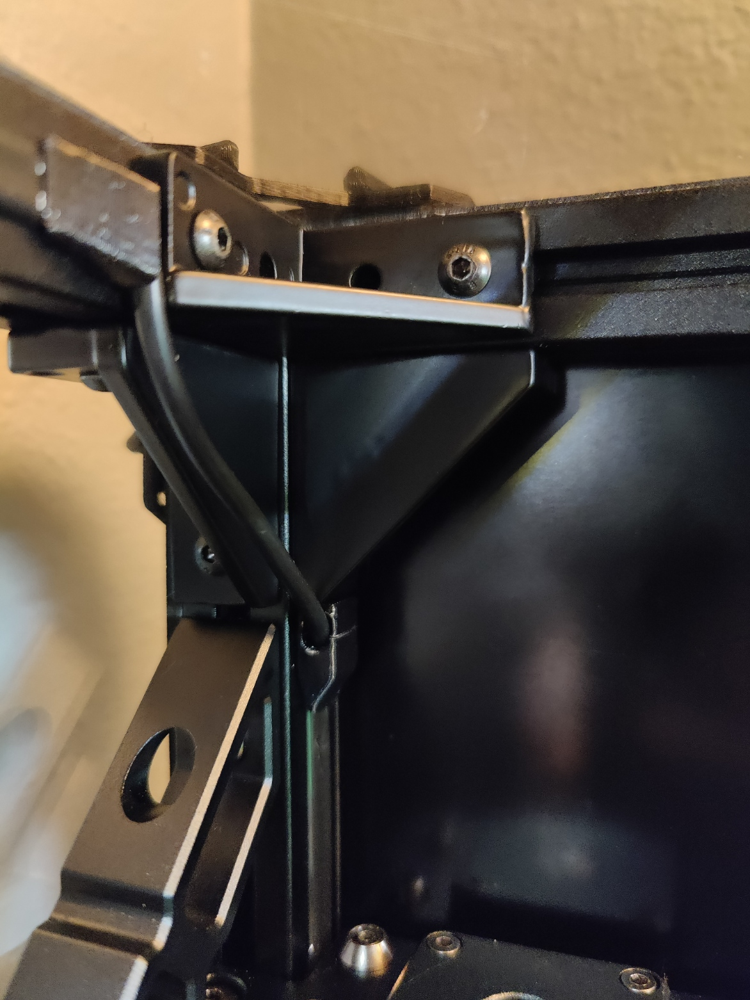
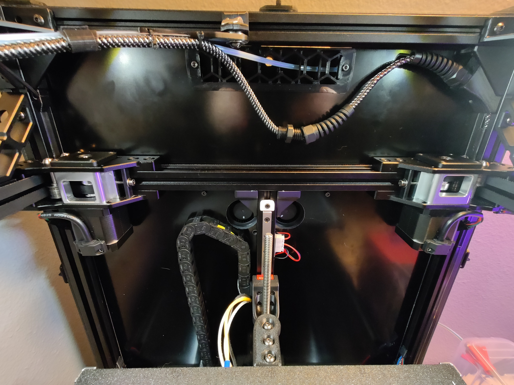
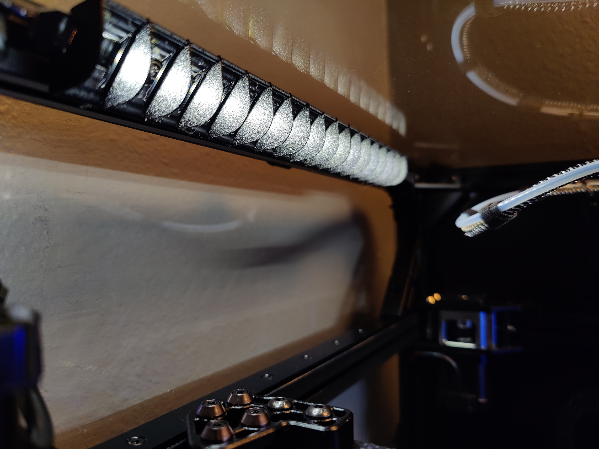
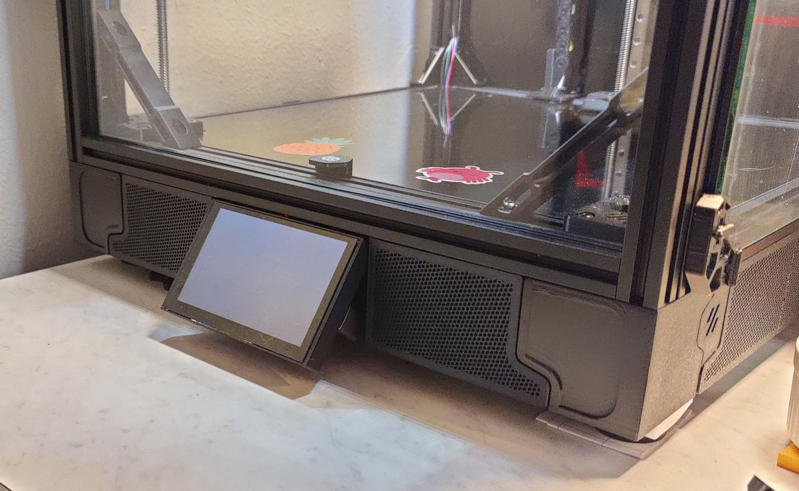

# Siboor Trident AWD June 2024 Mods

| Emoji | Description |
| ------------ | ----- | 
| 💯 |  Highly recomended |
| 👍 | Nice to have |
| 🤷‍ | Could go either way |
| 👎 | Not recomended |
| ❓ | Unknown |
| ✔ | Yes |
| ❌ | No |

## Hardware Mods
### Add 2040 Corner Brackets
| Extra Parts: ✔ | Recommended: 💯 |
| -------------- | --------------- |

Simple addition that improves frame rigidity.
- [ ] 16x 2040 Brackets
	- I bought mine from [here](https://www.aliexpress.us/item/3256802458987500.html) 
- [ ] m4x10mm BHSC
- [ ] m4 roll-in 2020 nuts

### Flip Rear Motors Downwards
| Extra Parts: ❌ | Recommended: 💯 |
| -------------- | --------------- |

Helps with wiring and gives additional space for other mods.

- [ ] Install the motors upside-down from what is shown in the manual.
    * Install the motors with wires facing the sides or rear. **Do not** direct the wires inwards as shown in the photo.
- [ ] **Invert** the motor step direction for x1 and y1

### Remove Cable Chain
| Extra Parts: ✔ | Recommended: 💯 |
| -------------- | --------------- |

Vastly improves input shaper graphs and allows for greater accelerations. In place of the cable change I used PG7 cable glands on both ends of the CAN bus cable but there are many ways you can go about this mod, such as using PUG adaptors.
  - [ ] [Bowden PTFE Tube Guide Arm and Can Bus Cable Support](https://www.printables.com/model/978123-voron-bowden-ptfe-tube-guide-arm-and-canbus-cable)
  - [ ] [SB2240 PG7 USB Strain Relief](https://www.printables.com/model/676208-sb2209-sb2240-pg7cnlinko-usb-strain-relief)
  - [ ] [2040 Bracket PG7 Mount](https://www.printables.com/model/1000097-2040-bracket-pg7-mount)
  - *Optional*
	  - [ ] Reprint Fume Pack with PTFE tube side exits
		  - *Note* The Fume Pack provided by Siboor has been modified so that both fan wires exit a _new_ hole in the bottom center instead of each fan wire exiting the port on each fan's side as in the source model. It's easy enough to use a drill and add this hole on to the reprinted part.

### Daylight On A Stick
| Extra Parts: ✔ | Recommended: 💯 |
| -------------- | --------------- |

Huge quality of life improvement to have built in lights that provide plenty of light on the build plate.
- [ ] [Daylight on a Stick](https://github.com/VoronDesign/Voron-Hardware/tree/master/Daylight)
	- There are various retailers that sell premade versions. You ideally want 1 for each side and optionally 1 for the front. 
- [ ] [Mounting Brackets](https://github.com/VoronDesign/Voron-Hardware/blob/master/Daylight/STL/Brackets_2020.stl)
- *Optional*
	- [ ] [Light Baffles](https://www.printables.com/model/315479-daylight-on-a-stick-mount)

### Flat Mesh Skirts
| Extra Parts: ✔ | Recommended: 👍 |
| -------------- | --------------- |

I did not order the decorative parts from Siboor and used the kit to print the rest of the parts once it was in a working state. I choose these skirts instead of the stock ones. Primary benefit is not having a bunch of large holes into the electronics bay, the other is you can use my Foldout Screen mount below.
- [ ] [Flat Mesh Skirts](https://github.com/livinhack/Flat_Mesh_Skirt_Remix_for_Siboor_Trident)

### Foldout Screen
| Extra Parts: ✔ | Recommended: 👍 |
| --------------- | --------------- |

I designed this because I liked the idea if being able to have the screen flush with the skirts. Turns out it was a lot more difficult to design than I had originally thought but I was able to get it workin in the end. See the [printables page](https://www.printables.com/model/1104995-voron-trident-btt-hdmi-5-fold-out-screen) for details.

### Panel Clips
| Extra Parts: ✔ | Recommended: 💯 |
| -------------- | ------------------ |

#### Filament Latch
These are an improvement over the standard Voron panel clips but can be a bit brittle with their filament hinges. The actual force applied to the panel does not relay on the filament however.
- [ ] [Filament Latch](https://www.printables.com/model/172368-voron-24-filament-latch-or-any-2020-extrusion)
	- Kit comes with 3mm panel and 3mm foam tape. Print a few test sizes before committing to a full set but the size I ended up on were 5.5mm

#### Annex Panel Clips
Almost no assembly time and flatter profile compared to the Filament Latch but looses some cool factor. These work well but are rough on the finger tips if you have to keep taking panels on and off. They also don't stay attached to the frame after freeing the panel. I decided to try these when I switched to glass panels.
 - [ ] [Annex Panel Clips](https://github.com/Annex-Engineering/Annex-Engineering_User_Mods/tree/main/Printers/All_Printers/annex_dev-Panel_2020_Clips_and_Hinges)

### Nozzle Brush
| Extra Parts: ✔ | Recommended: 👎 |
| -------------- | --------------- |

On paper a nozzle brush seems like a great idea however after installing one it seemed to make everything worse. This is likely due to me not using it right but I didn't want to spend any more time on trying to make it work after trying out the line purge from [KAMP](https://github.com/kyleisah/Klipper-Adaptive-Meshing-Purging/tree/main). 
- [ ] Bambu Lab A1 Silicon Brush
- [ ] [Nozzle Scrubber & Decontaminator](https://www.printables.com/model/796563-nozzle-scrubber-decontaminator-for-voron-24-using)
- [ ] [Nozzle Scrubber Arm Extension](https://www.printables.com/model/298565-nozzle-scrubber-arm-extension-voron-trident)

### Glass Panels
| Extra Parts: ✔ | Recommended: 👍 |
| -------------- | -------------- |

My original PC top panel was already showing a bunch of scratches from just a short time using the printer. I got a bunch of glass from a guy that re-did windows on his house that I cut down with a "pen" style glass cutter and ground down the edges with 150 grit sand paper on a palm sander.

Cutting was not difficualt, in fact this was probably my 3rd time ever cutting glass. Just be sure to measure 3 times before cutting as it's basicly impossible to make small adjustments later (with the simple tools I had).
After cutting, the panel clips needed re-printing since the glass I got was ~1/8th inches == 3.175 mm. Went with the [Annex Panel Clips](https://github.com/Annex-Engineering/Annex-Engineering_User_Mods/tree/main/Printers/All_Printers/annex_dev-Panel_2020_Clips_and_Hinges) this time since they are much simpler to "assemble". See the section above for thoughts about those.

Side note, these make the printer _heavy af_.

### XOL/Achetype Toolhead
| Extra Parts: ✔ | Recommended: 👍 |
| -------------- | -------------- |

Seen these toolhaeds recomeneded over Stealthburner quite often. Currently trying out Achetype Blackbird and my first impressions are positive. I was a little worried about ditching the CNC carrige however it seems like the Achetype base is just as rigidge and never needing to ajust belts again is a plus in my mind. Toolhead weight went down ~100g and input shaper graphs look better and have a higher recomended acceleration. 

There is no x limit switch on the stock Archetye so I have switched over to sensorless homing. This works fine on the AWD setup.

I have made an extruder block for the [Phaetus Apus 2 extruder](https://www.printables.com/model/1140619-archetype-apus2-extruder-block).

### HULA
| Extra Parts: ✔ | Recommended: 👍 |
| -------------- | -------------- |

More than likely, you have already seen a video about HULA. While they do not improve printer performace the do improve the user experiance if your printer sits on the same desk you work at.

I designed a custom foot that pops into the stock rubber feet which makes HULA easy to use.

- [ ] [HULA](https://www.printables.com/model/898357-hula-v10-for-voron-printers)
- [ ] [Custom Foot Mount](https://www.printables.com/model/1318369-cylindrical-rubber-foot-adaptor-for-hula)

